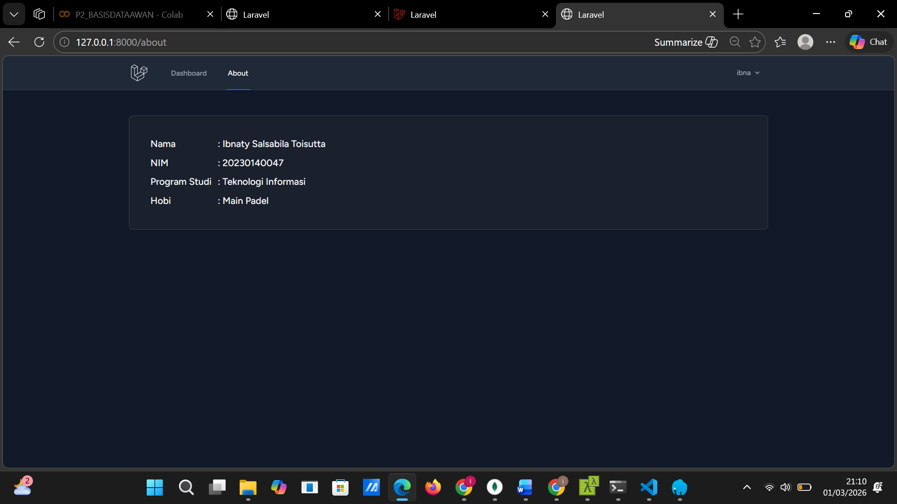
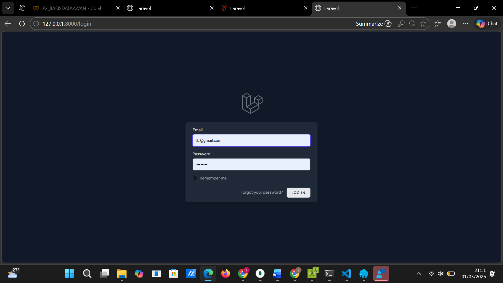
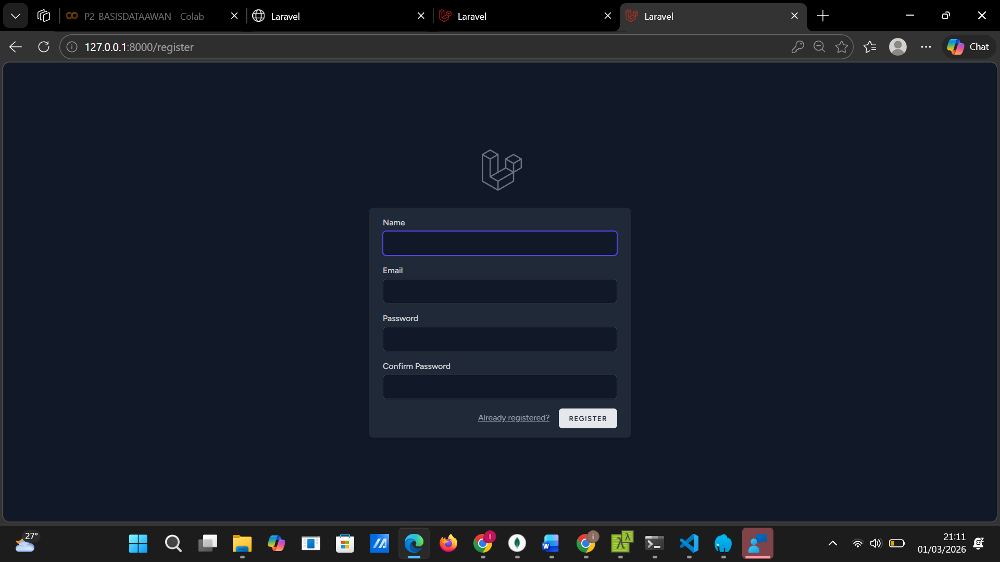

## PRAKTIKUM 1: Setup & UI Dasar
### Hasil Tampilan

---

## PRAKTIKUM 2: Otentikasi & Profile
### Tampilan About

### Tampilan Login

### Tampilan Register

---

## PRAKTIKUM 3: Database & Eloquent Model

### Model 

### Migration

### Database 

